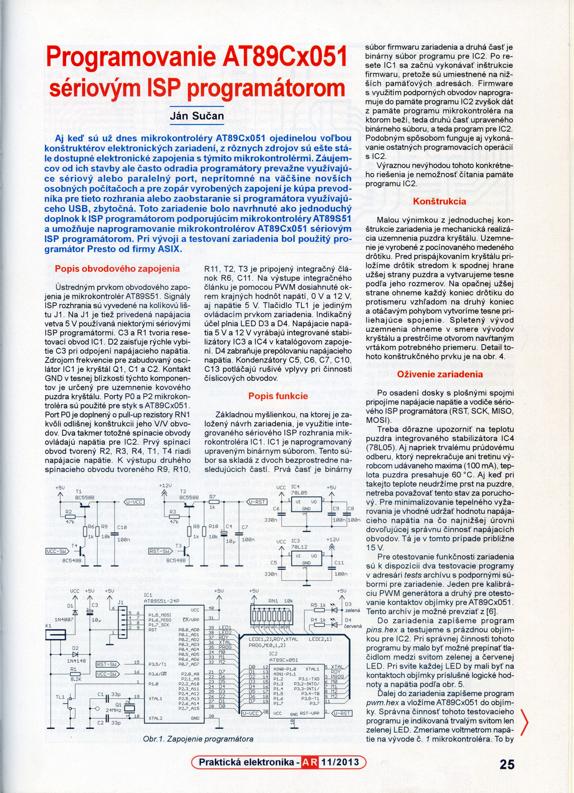
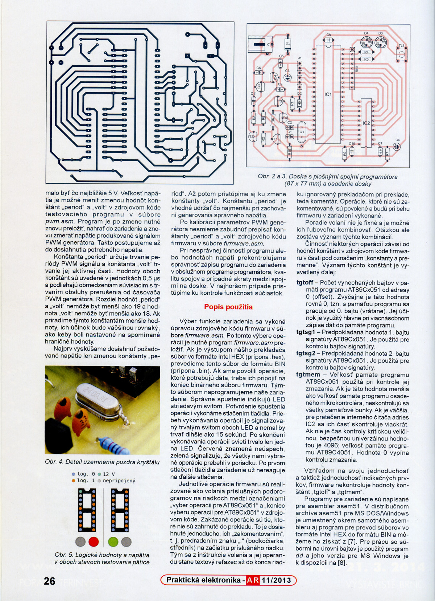
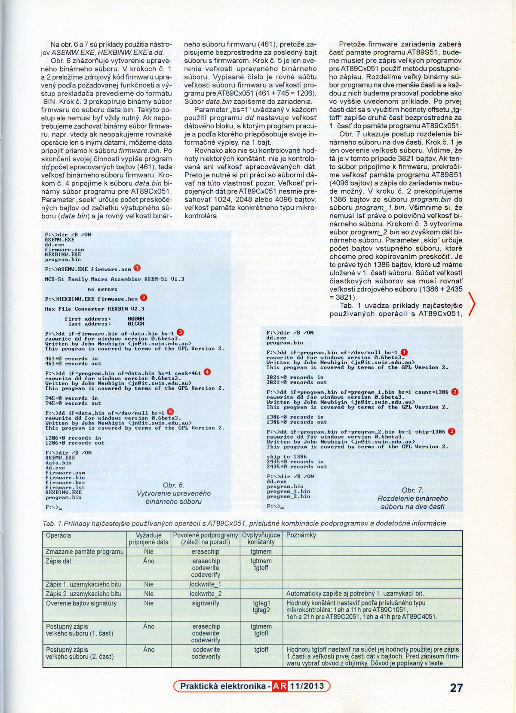
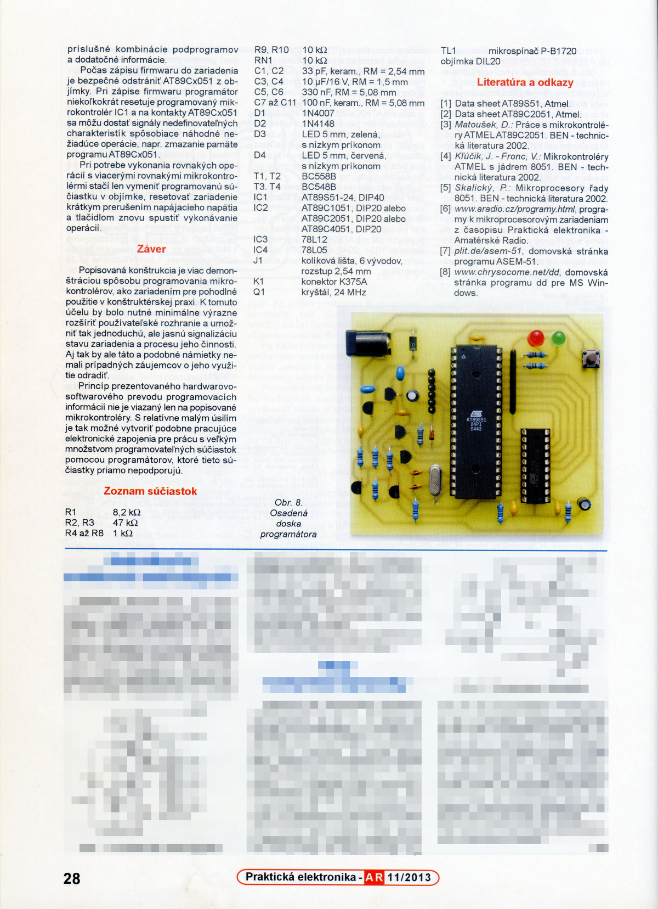

# AT89Cx051 programming using a serial ISP programmer

The article was published in November 2013 in Czech magazine [Praktická
elektronika - Amatérské Radio](http://aradio.cz). It is written in Slovak
language.

The article describes a method of programming AT89Cx051 microcontrollers using a
serial ISP programmer. Basic principle is that a special firmware is written to
the program memory of the on-board AT89S51.

This firmware consists of two parts. The first part contains routines for
programming operations for AT89Cx051 and is placed at the entry point address in
the AT89S51 program memory. The second part follows immediately after the first
part and contains a data to be written to the AT89Cx051.

User selects programming operations by simple modification of firmware source
code. Firmware then needs to be recompiled and optionally concatenated with data
for AT89Cx051. When this file is written to the AT89S51, the microcontroller
starts executing user selected firmware routines which can use the data for
AT89Cx051 residing in AT89S51 memory.

Firmware supports erasing, writing and verifying of the program memory, writing
and verifying signature bytes.

